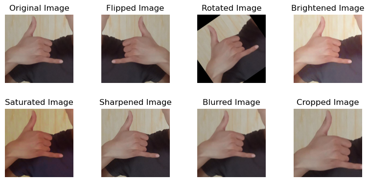
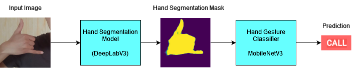
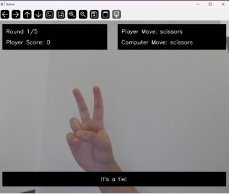
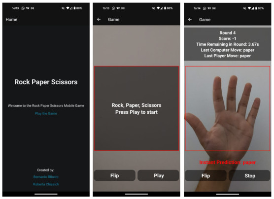
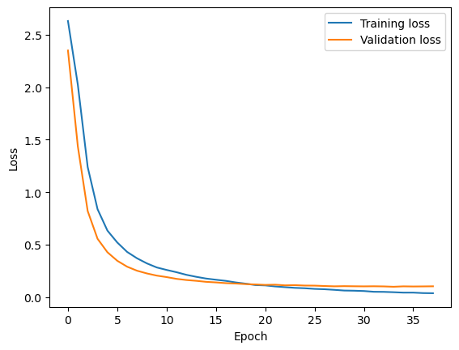
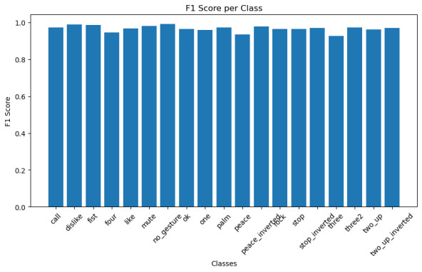

# Real-Time Gesture Recognition
Project for the Computer Vision 2023-2024 course at Sapienza

## Team

| **Name / Surname** | **Linkedin** | **GitHub** |
| :---: | :---: | :---: |
| `Bernardo Perrone De Menezes Bulcao Ribeiro ` |  |  |
| `Roberta Chissich ` |  |  |

## Table of Contents
+ [Abstract](#abstract)
+ [Introduction](#intro)
+ [Project Description](#project)
+ [System components](#architecture)
+ [Desktop Game](#game)
+ [Conversion to TF Lite Model](#tflite)
+ [Mobile App](#app)
+ [Results](#results)
+ [Conclusions](#conclusion)
+ [References](#references)

## Abstract 

In this project, we aim to develop a mobile-ready real-time gesture recognition system that allows users to play a game of Rock-Paper-Scissors against a computer. The system will capture live video feeds of the user's hand gestures using a camera, analyze the movements to recognize the gestures using Deep Convolutional Neural Networks framed as a classification task, and translate them into commands to play the game. The project will involve implementing and training different deep CNN models, comparing their performance, and developing a mobile application to enable users to interact with the system. For training, an adaptation for classification of the HaGRID dataset is used. The project will demonstrate the capabilities of Deep Learning in real-time gesture recognition and showcase the potential applications of this technology in human-computer interaction and gaming.

## Introduction 

Hand Gesture Recognition is a technology that enables computers to interpret human gestures as commands. It works by capturing and analyzing the movements of the hands to recognize specific gestures and translate them into actions. This technology has a wide range of applications, from robotics and gaming to assistive technologies and human-computer interaction. Static Hand Gesture Recognition is a subset of this technology that focuses on recognizing static hand poses or shapes, which can be used to classify different gestures and commands based on a frame-by-frame analysis of the hand's position and shape.

### Importance and Applications 

One of the main applications of Hand Gesture Recognition is Human-Robot Interaction and Human Computer Interaction. By using hand gestures as commands, users can control robots, computers, and other devices in a more intuitive and natural way. This technology is particularly useful in scenarios where traditional input devices like keyboards and mice are not practical or feasible, such as in robotics, virtual reality, and augmented reality applications. Hand Gesture Recognition can also be used in healthcare, gaming, and security applications, among others.

## Project Description 

### Objective
The primary objective of this project is to develop a real-time gesture recognition system that allows users to play a game of Rock-Paper-Scissors against a computer. The system captures live video feeds of the user's hand gestures using the camera, analyzes the movements to recognize the gestures using Deep Convolutional Neural Networks framed as a classification task, and translate them into commands to play the game. The computer will generate its own gestures randomly, and the system will determine the winner based on the rules of the game.

### Key Goals
- **Motion Detection**: Utilize a standard smartphone camera to capture hand movements and translate them into commands.  
- **Deep CNN Classification**: Implement a Deep Convolutional Neural Network (CNN) to classify hand gestures in real-time.
- **Comparison of Models**: Compare the performance of different deep CNN models for gesture recognition, as well as the impact of data augmentation techniques.
- **Mobile Application**: Implement a simple and intuitive mobile application that allows users to play the game using their smartphones.

## System Architecture 

The system architecture for our hand gesture recognition project is designed to efficiently capture, process, and classify hand gestures in real-time. At a high level, the system comprises a data acquisition module, a pre-processing unit, a gesture recognition module powered by deep learning models, and an output module that interprets the recognized gestures into game commands for playing Rock-Paper-Scissors. The architecture leverages advanced neural network models and robust training methodologies to ensure high accuracy and responsiveness.

### Data Acquisition
The data acquisition module is responsible for capturing live video feeds of the user's hand gestures. This is typically done using a standard smartphone camera, which provides the necessary input data for further processing. The module ensures that the video feed is of sufficient quality and resolution to allow accurate gesture recognition.

### Pre-Processing Unit
Once the raw video data is captured, it undergoes a series of pre-processing steps. These steps include resizing the video frames, normalizing pixel values, and applying data augmentation techniques such as rotation, scaling, and flipping. Pre-processing is crucial for enhancing the robustness of the gesture recognition system by making the model invariant to various transformations and lighting conditions.

### Gesture Recognition Module
The core of the system is the gesture recognition module, which employs deep convolutional neural networks (CNNs) to classify hand gestures. We explored multiple model architectures for this purpose:

### Dataset

The dataset used for training the gesture recognition models is an adapted version of the HaGRID dataset, containing 153,735 training images from HaGRID (Hand Gesture Recognition Image Dataset) modified for image classification instead of object detection. The dataset contains images of Hand Gestures being performed by different individuals under various lighting conditions and backgrounds. There are 19 labelled classes corresponding to different hand gestures, containing around 6900 images per class. The possible labels can be seen below:

Gesture Classes:

- call, dislike, fist, four, like, mute, no_gesture, ok, one, palm, peace, peace_inverted, rock, stop, stop_inverted, three, three2, two_up, two_up_inverted

The dataset can be downloaded from the following link: [Hagrid Dataset for Classification](https://huggingface.co/datasets/cj-mills/hagrid-classification-512p-no-gesture-150k-zip) [1].

### Data Preprocessing and Augmentation

The first step in the project is to preprocess and augment the dataset. This is done in the following Jupyter Notebook: [Data Preprocessing and Augmentation](https://github.com/b-rbmp/cv-gesture-recognition/blob/main/preprocessing/data_preprocessing.ipynb). It is divided into two main sections: Data Preprocessing and Data Augmentation.

**Data Preprocessing**: The data preprocessing step involves loading the full dataset and separating the data into two sets: training-validation and test. The training-validation set is further split into training and validation sets in the training scripts. This is done because the training-validation set is going to be augmented, while the test set is going to be used to evaluate the models' performance.

**Data Augmentation**: The data augmentation step involves applying various transformations to the training-validation set to increase the dataset's size and diversity. The transformations include:
- Horizontal Flip
- Random Rotation of Images from -40 to 40 degrees
- Random Brightness Adjustment from -50 to 50 (adjusting the "v" of the HSV color space)
- Random Saturation Adjustment from -50 to 50 (adjusting the "s" of the HSV color space)
- Sharpening the image
- Random Gaussian Blurring the image from k=3, k=5, k=7
- Random Crop of the image with 20% zoom and horizontal and vertical shift varying from -50 to 50 pixels

You can see the transformations below:

These transformations are not all applied to each image. Instead, for each image, there is a probability of 15% that each transformation will be applied. This was done due to the already large size of the dataset and the computational resources available.

### Model Architectures

For this project, we implemented and compared the following model architectures for hand gesture recognition:

#### **1. Simple CNN Model**

To serve as a baseline for more complex and/or powerful pretrained models, we implemented a simple CNN model for hand gesture recognition. It is divided in a feature extraction part and a classification part. The feature extraction part of the model consists of 5 convolutional blocks. Each block includes:
- Convolutional Layer: Applies a convolution operation with a specific number of filters, kernel size, stride, and padding.
- ReLU Activation: Applies the ReLU activation function.
- Max Pooling Layer: Applies a max pooling operation to reduce the spatial dimensions.
    
After the convolutional and pooling layers, the output is flattened and passed through two fully connected layers with ReLU activation functions and dropout of 0.5. The final layer is a fully connected layer that maps the features to the number of classes (19 in this case).

The total Layer Breakdown is:
1. Feature Extractor:
    - Convolutional Layers: 5
    - ReLU Activations: 5
    - Max Pooling Layers: 5
2. Classifier:
    - Fully Connected Layers: 3
    - ReLU Activations: 2
    - Dropout: 2

The training script for the Simple CNN model can be found [here](simple_cnn/train.ipynb)

#### **2. ResNet50**

ResNet50 is a deep residual network that has shown excellent performance in image classification tasks. It is a 50-layer deep neural network that uses skip connections to overcome the vanishing gradient problem and enable training of very deep networks. The ResNet50 model consists of a series of convolutional layers, followed by residual blocks that contain skip connections. The model architecture is pre-trained on the ImageNet dataset. 

For this project, we fine-tuned the ResNet50 model on the hand gesture recognition dataset. The model was adapted to classify hand gestures by replacing the final fully connected layer with a new layer that maps the features to the number of classes (19 in this case). The pre-trained weights of the ResNet50 model were loaded and fine-tuned on the hand gesture recognition dataset.

The training script for the ResNet50 model can be found [here](resnet50/train.ipynb)

#### **3. MobileNetV3 Large**

MobileNetV3 Large is a lightweight and efficient convolutional neural network architecture designed for mobile and edge devices. It is optimized for speed and accuracy, making it suitable for real-time applications. The MobileNetV3 Large model consists of a series of depthwise separable convolutions, squeeze-and-excitation blocks, and linear bottlenecks. The model architecture is pre-trained on the ImageNet dataset.

For this project, we fine-tuned the MobileNetV3 Large model on the hand gesture recognition dataset. The model was adapted to classify hand gestures by replacing the final layer with three fully connected layers, where the first two layers have ReLU activation functions and dropout of 0.5. The final layer maps the features to the number of classes (19 in this case). The pre-trained weights of the MobileNetV3 Large model were loaded and fine-tuned on the hand gesture recognition dataset.

The training script for the MobileNetV3 Large model can be found [here](mobilenetv3/train.ipynb)

#### **4. HandSeg + MobileNetV3 Large**

Inspired by the following Article: [A Real-time Hand Gesture Recognition System for Human-Computer and Human-Robot Interaction](https://iris.uniroma1.it/handle/11573/1683653) [3], where the authors propose a method where Hand Gesture Recognition is done using the mask generated by a Hand Segmentation procedure, we implemented a similar approach. In this project, we propose a combined model containing a pre-trained Hand Segmentation model and a MobileNetV3 Large model for hand gesture recognition. The Hand Segmentation model is used to generate a mask of the hand in the input image, which is then fed into the MobileNetV3 Large model for gesture recognition. The Hand Segmentation model is a pretrained DeepLabV3 model pretrained on the COCO dataset, and the implementation is taken from the [hands-segmentation-pytorch](https://github.com/guglielmocamporese/hands-segmentation-pytorch) repository [4].

The architecture can be seen below:

Two approaches are used for training:
1. **Frozen Hand Segmentation Training**: The Hand Segmentation model is pretrained and frozen. The MobileNetV3 Large model is trained using the output of the Hand Segmentation model.
2. **End-to-End Training**: The Hand Segmentation model is pretrained and fine-tuned along with the MobileNetV3 Large model.

The training script for the HandSeg + MobileNetV3 Large model can be found [here](handsegmentation/train.ipynb)

### Data preparation

For all the architectures, a CustomDataset is created to load and preprocess the dataset. It loads the augmented or non-augmented train-validation dataset separated in the data preprocessing step. The dataset is then split into training and validation sets using a 80-20 split. The images are resized to 300x300 pixels and normalized to the range [0, 1]. To encode the labels, a LabelEncoder is used to convert the gesture classes to numerical labels. The dataset is then transformed into PyTorch DataLoader objects for training and validation, with a batch size of 16 and with shuffling enabled.

**ResNet50**
The ResNet50 model, part of the Residual Networks (ResNet) family, is particularly well-suited for deep learning tasks due to its unique architecture that includes residual blocks. These blocks allow the model to learn identity mappings, which help in training very deep networks by mitigating the vanishing gradient problem. ResNet50 has 50 layers, making it a robust choice for capturing complex patterns in gesture recognition. Its performance is further enhanced by data augmentation techniques, leading to high accuracy and generalization.

The models are trianed using **HaGRID (HAnd Gesture Recognition Image Dataset)**. HaGRID is a comprehensive dataset containing 554,800 FullHD RGB images divided into 18 gesture classes and an additional no_gesture class for images with a second free hand. The dataset includes 723GB of data, with 410,800 images for training, 54,000 for validation, and 90,000 for testing, involving 37,583 unique individuals in various indoor lighting conditions. The subjects' ages range from 18 to 65, and the images were taken at distances of 0.5 to 4 meters from the camera, including extreme conditions like facing and backing to a window. 

[The HaGRID library on GitHub](https://github.com/hukenovs/hagrid)

### Training Components

We use **Adam optimizer** chosen for its ability to handle sparse gradients and its efficiency in computation, with a Linear Learning Rate Scheduler, starting from 1e-5, and we employ **CrossEntropyLoss**, suitable for multi-class classification tasks.
A linear learning rate scheduler (**LinearLR**) adjusts the learning rate from an initial factor of 1.0 to an end factor of 0.3 over 40 iterations. This helps in gradually reducing the learning rate to fine-tune the model during training.
A class **SaveModelWithBestValLoss** is created and used to save the model with the best validation loss. This ensures that the best performing model on the validation set is preserved. The model is saved as a `.pth` file, which can be loaded for inference or further training.

### Training loop

The training loop runs for up to 50 epochs, with each epoch consisting of a training and validation phase. During the training phase, the model is set to training mode. For each batch, inputs and labels are processed, and the loss is computed and backpropagated. The optimizer steps are taken, and the learning rate is updated. The training loss is accumulated and averaged at the end of each epoch.

During the validation phase, the model is set to evaluation mode. No gradient computations are performed. The validation loss is accumulated and averaged. If the validation loss does not improve over three consecutive epochs, early stopping is triggered.

### Testing

After training, the best model is loaded and tested on the test set. The test set is loaded and preprocessed similarly to the training and validation sets. The model is evaluated on the test set using accuracy, precision, recall, and F1 score metrics. Also, a classification report is generated to analyze these results for each class. The results are displayed and saved for further analysis. 

## Desktop Game 

In order to demonstrate the capabilities of the gesture recognition system, we developed a simple  openCV-based desktop game that allows users to play Rock-Paper-Scissors against the computer. The game captures live video feeds of the user's hand gestures using the camera and uses the trained model to recognize the gestures. The computer generates its own gestures randomly, and the game determines the winner based on the rules of Rock-Paper-Scissors. 

Each game lasts 5 rounds, and the winner is determined based on the majority of rounds won. The game displays the user's and computer's gestures, the round number, and the current score. At the end of the game, the winner is announced, and the user can choose to play again.

As for the hand gestures, each player move is a 3 second capture where the gesture with the highest predicted frequency is used, and is converted to Rock, Paper or Scissors using mapping between the predicted classes and the Rock-Paper-Scissors gestures. The mapping is as follows:

- rock = fist
- paper = palm, stop, stop_inverted
- scissors = peace,peace_inverted

An image of the game can be seen below:

## Conversion to TF Lite Model 

In order to port the model to a mobile application, we converted the trained PyTorch model to a TensorFlow Lite model. The conversion process was done using Google's [Ai Edge Torch](https://github.com/google-ai-edge/ai-edge-torch) library, which provides a simple tool to convert PyTorch models to TensorFlow Lite models by passing the PyTorch model and a sample input tensor.

The mobile conversion script can be found [here](mobile_converter/convert_mobile.py)

## Mobile App 

The mobile application was developed using React Native, a popular framework for building cross-platform mobile applications. The application allows users to play Rock-Paper-Scissors against the computer using hand gestures captured by the smartphone's camera. The application uses the TensorFlow Lite model to recognize the gestures in real-time and determine the winner of each round. The conversion between the model's predicted class and the Rock-Paper-Scissors gestures is done in the same way as in the desktop game, seen in the previous section.

The source code for the mobile application can be found [in this folder](android_app), while the APK file for testing on your device can be downloaded [here](https://www.dropbox.com/scl/fo/idxhyvq3x1l6byuoyyccc/AGBlFAYwfz7J5W_KJnmMFog?rlkey=zbkhssl8974cv6t2u5493p5pz&st=zdeq257y&dl=0). Note that the app was tested in a Google Pixel 8 and the performance will vary depending on the device's camera quality and processing power.

An image of the mobile app interface can be seen below: 

## Results 

Due to the computational resources available and big size of the dataset, all architectures were initially trained on a subset of the data, with 20% of the original dataset for training/validation and 10% for testing and without data augmentation. This was done to allow a comparison of all the models. Then, after the comparison, the best performing model was then trained with data augmentation on the same subset of the data to evaluate the impact of data augmentation on the model's performance. Finally, the best performing model was trained on the full dataset with data augmentation to evaluate the model's performance on the full dataset.

### Comparison of All Models Without Augmented Data

The performance of the models without data augmentation was evaluated using accuracy, precision, recall, and F1 score. Then analyzed to understand the baseline capabilities of each architecture. The results show a notable difference in performance:

| Model Configuration                                             | Accuracy      | Precision     | Recall        | F1 Score      |
|-----------------------------------------------------------------|---------------|---------------|---------------|---------------|
| MobileNetV3 Large      | 0.9699        | 0.9700        | 0.9699        | 0.9699        |
| ResNet50            | 0.9846        | 0.9847        | 0.9846        | 0.9846        |
| Hand Segmentation (Frozen) + MobileNetV3 Large | 0.9657    | 0.9660        | 0.9657        | 0.9657        |
| Hand Segmentation (Unfrozen) + MobileNetV3 Large | 0.9478    | 0.9483        | 0.9478        | 0.9477        |
| Simple CNN Model | 0.6137        | 0.6122        | 0.6137        | 0.6103        |

The comparison highlights the significant impact of advanced model architectures like ResNet50 and MobileNetV3 over simpler CNN models. These advanced models achieve high accuracy, demonstrating their robustness in classification tasks. The best performing model was found to be ResNet50, which was then used for further analysis with data augmentation.

### Data Augmentation Impact on ResNet Model

To further understand the impact of data augmentation, we compared the ResNet50 model's performance with and without augmented data:

| Model Configuration                                             | Accuracy      | Precision     | Recall        | F1 Score      |
|-----------------------------------------------------------------|---------------|---------------|---------------|---------------|
| ResNet50 with Data Augmentation           | 0.9864        | 0.9865        | 0.9864        | 0.9864        |
| ResNet50 without Data Augmentation           | 0.9846        | 0.9847        | 0.9846        | 0.9846        |

The results indicate that while the ResNet50 model performs exceptionally well without data augmentation, applying data augmentation slightly enhances its precision, ensuring a more balanced and generalized performance. The marginal improvement suggests that ResNet50 is highly effective in recognizing gestures even with a limited amount of training data, but data augmentation can still provide an edge in terms of precision.

### Issues with ResNet Model and the Mobile App

Despite being the best performing model, we found that the ResNet50 model was too large to be used in the mobile application since it could not be loaded due to memory constraints, even after being converted to a TensorFlow Lite model. This issue was likely due to the large number of parameters in the ResNet50 model, which made it unsuitable for deployment on mobile devices with limited resources. As a result, we had to choose a smaller model, such as MobileNetV3, for deployment in the mobile application.

### Final Model for Mobile App: MobileNetV3 Large with Data Augmentation

The MobileNetV3 Large model was trained with data augmentation on the full dataset to evaluate its performance on the complete dataset. The model achieved an accuracy of 0.9699, precision of 0.97, recall of 0.9699, and an F1 score of 0.9699. The model was then converted to a TensorFlow Lite model for deployment in the mobile application, and is used in the .apk file provided for testing sucessfully on a Google Pixel 8, without performance issues.

The evolution of the Training and Validation Loss per epoch can be seen below:

The F1 score per class can be seen below:

## Conclusions 

### Discussion
The performance analysis of various models in this project highlights the significant impact of advanced architectures and data augmentation on the accuracy and robustness of hand gesture recognition systems. The comparison of models showed that more complex models like ResNet50 and MobileNetV3 outperformed simpler CNN models, achieving higher accuracy and precision. The results also demonstrated the importance of data augmentation in enhancing the model's performance, especially in cases where the dataset is limited or imbalanced.

The development of the desktop game and mobile application showcased the real-time capabilities of gesture recognition systems and their potential applications in human-computer interaction and gaming. The desktop game allowed users to play Rock-Paper-Scissors against the computer using hand gestures, while the mobile application enabled users to interact with the system using their smartphones. The conversion of the model to a TensorFlow Lite model facilitated deployment on mobile devices, ensuring efficient and lightweight performance.

### Limitations and Future Work
Despite the successful implementation of the gesture recognition system, there are several limitations and areas for future work:

- **Model Optimization**: The issue with the ResNet50 model's size highlights the need for model optimization to reduce the number of parameters and memory footprint for deployment on mobile devices. Future work could focus on developing lightweight models that maintain high accuracy while being suitable for mobile applications.

- **Real-Time Performance**: While the system demonstrated real-time gesture recognition capabilities, there is room for improvement in terms of speed and efficiency. Future work could explore optimization techniques, such as quantization and pruning, to enhance the system's real-time performance.

- **User Experience**: The desktop game and mobile application provide a basic interface for users to interact with the system. Future work could focus on enhancing the user experience by adding features like gesture feedback, game customization, and multiplayer support.

- **Gesture Recognition**: The system currently recognizes a limited set of hand gestures for playing Rock-Paper-Scissors. Future work could expand the gesture recognition capabilities to include a wider range of gestures and commands for different applications.

## References 

[1] Christian Mills. Adapted HaGRID Dataset https://huggingface.co/datasets/cj-mills/hagrid-classification-512p-no-gesture-150k-zip

[2] Alexander Kapitanov et Al. Original HaGRID Dataset https://github.com/hukenovs/hagrid

[3] Valerio Ponzi et Al. A Real-time Hand Gesture Recognition System for Human-Computer and Human-Robot Interaction https://hdl.handle.net/11573/1683653

[4] Guglielmo Camporese. Hands Segmentation is All You Need https://github.com/guglielmocamporese/hands-segmentation-pytorch